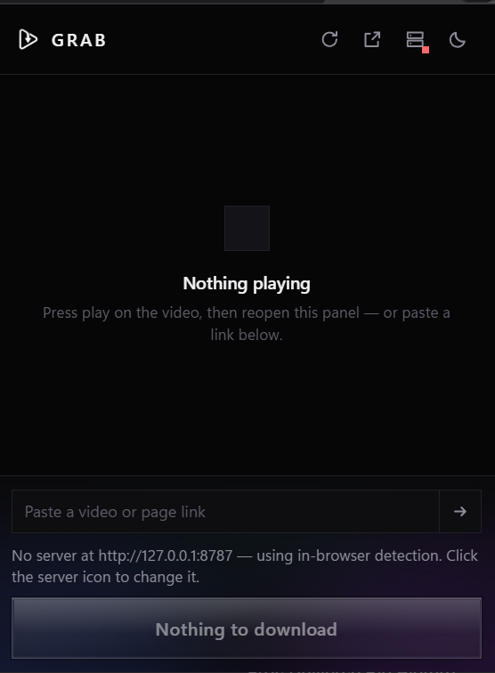
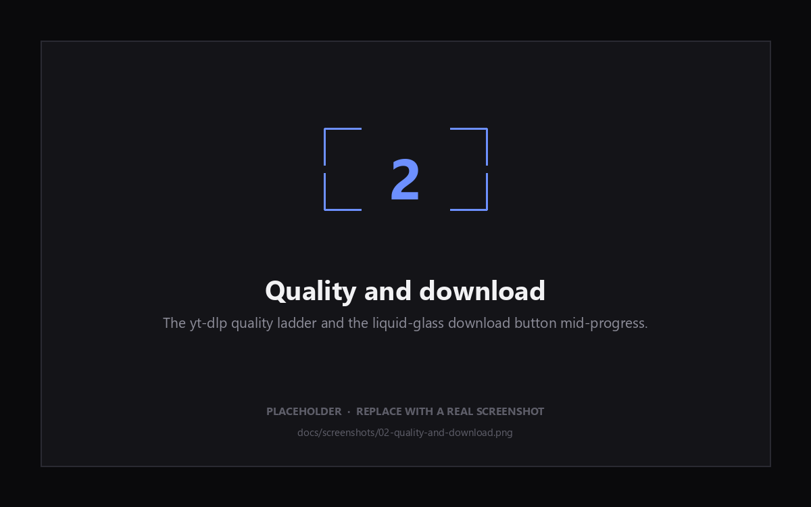
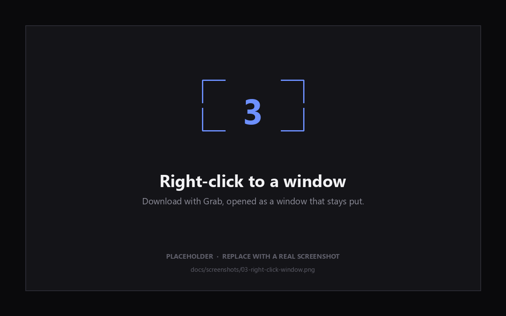

<p align="center">
  
</p>

<p align="center">
  <b>Detects the video a page is playing, and saves it properly.</b><br>
  A Manifest&nbsp;V3 browser extension backed by a local yt-dlp&nbsp;+&nbsp;ffmpeg server.
</p>

<p align="center">
  
  
  
  
  
</p>

<p align="center">
  <a href="#quick-start">Quick start</a> ·
  <a href="#screenshots">Screenshots</a> ·
  <a href="#using-it">Using it</a> ·
  <a href="#server-api">API</a>
</p>

---

## What it is

Two parts that work together:

| | |
| --- | --- |
| **`server/`** | FastAPI wrapping yt-dlp and ffmpeg. It knows the sites, picks real formats, and muxes properly. |
| **`src/`** | Manifest V3 extension, loaded unpacked. It detects what the current tab is playing, shows it, and asks the server to fetch it. |

Start the server once and leave it running; after that the extension is the
whole interface. Everything stays on your machine — the extension talks only to
the address you configure, which defaults to `http://127.0.0.1:8787`.

The panel is deliberately square — no rounded corners anywhere — with a near
black dark theme, a grey-white light theme, and a liquid-glass download button.

### Quick start

```bash
pip install -r server/requirements.txt   # once, plus ffmpeg on your PATH
python server/server.py                  # leave this running
```

Then `chrome://extensions` → **Developer mode** → **Load unpacked** → this
folder. Full detail below.

## Screenshots

| | |
| --- | --- |
|  | **The panel** — square, near-black, with the link field and the glass button. Shown before anything is playing and with the server not yet started, hence the red dot. |
|  | **Quality and download** — the yt-dlp quality ladder, and the glass button filling with progress. |
|  | **Right-click to a window** — *Download with Grab…* opens a window that stays put. |

<sub>The lower two are still placeholders. Drop replacements into
`docs/screenshots/` under the same names and the README picks them up.</sub>

---

## 1. Install the server

You need **Python 3.10+** and **ffmpeg on your PATH**. ffmpeg is not optional:
without it there is no merged MP4 above 720p and no MP3 at all.

```bash
# ffmpeg
winget install Gyan.FFmpeg          # Windows
brew install ffmpeg                 # macOS
sudo apt install ffmpeg             # Debian/Ubuntu

# the server itself
pip install -r server/requirements.txt
```

Check it took: `ffmpeg -version` should print something.

## 2. Start the server

Paths below are relative to the repo root. If you keep a virtualenv inside
`server/` you will usually be one level down instead — drop the `server/`
prefix and run `python server.py`.

```bash
python server/server.py        # from the repo root
cd server && python server.py  # from inside server/
```

```
Grab server on http://127.0.0.1:8787  ->  C:\Users\you\Downloads\Grab
```

It stays in the foreground; leave that terminal open, and Ctrl+C to stop it.

If it exits with `[Errno 10048] only one usage of each socket address`, the
port is already taken — usually by a copy of this server you forgot was
running. Either use that one, or free the port:

```powershell
Get-NetTCPConnection -LocalPort 8787 -State Listen |
  ForEach-Object { Stop-Process -Id $_.OwningProcess -Force }
```

Useful flags — each also readable from a `GRAB_*` environment variable:

| Flag | Default | What it does |
| --- | --- | --- |
| `--port` | `8787` | Port to listen on |
| `--dir` | `~/Downloads/Grab` | Where finished files land |
| `--host` | `127.0.0.1` | Leave this alone unless you mean it |
| `--workers` | `3` | Concurrent downloads |
| `--cookies-from-browser` | off | `chrome`, `edge`, `firefox`, `brave` … |
| `--cookies` | off | Path to a `cookies.txt` |

`--cookies-from-browser chrome` is what makes private and logged-in videos work
— Instagram, Facebook, and LinkedIn generally need it. Close Chrome first; it
locks its cookie database while running.

Keeping yt-dlp current matters more than anything else here, because sites
change constantly: `pip install -U yt-dlp`.

## 3. Load the extension

One package works in all three browsers. The manifest carries both background
forms, and each browser ignores the one it does not understand.

**Chrome or Edge** (116+)

1. Open `chrome://extensions`, turn on **Developer mode**.
2. **Load unpacked** → select this folder.
3. Pin it, so the badge stays visible.

**Firefox** (142+)

1. Open `about:debugging#/runtime/this-firefox`.
2. **Load Temporary Add-on** → pick `manifest.json` in this folder.
3. Open **Extensions → Grab → Permissions** and allow access to all sites.

That third step is not optional. Firefox treats MV3 host permissions as opt-in,
so until you grant it, page detection finds nothing and the panel stays empty.
Chrome grants them at install time, which is why it needs no equivalent step.

A temporary add-on disappears when Firefox restarts. To keep it, see
[Signing for Firefox](#signing-for-firefox) below.

## 4. Point it at your server

Two places, same setting:

- **In the popup** — the server button sits next to the theme toggle, with a dot
  showing green when the server answers and red when it does not. Click it for
  an inline field with the address, then **Save**.
- **In the options page** — **More** in that bar, or the extension's Details →
  Extension options. Adds a connection test that reports the yt-dlp version,
  whether ffmpeg was found, and where files are being written.

Only change it if you moved the server's port or host.

---

## Signing for Firefox

Firefox will not permanently install an unsigned add-on. Signing is free, and
the **unlisted** channel skips the review queue.

There is no key of your own to manage — Mozilla holds the signing key and signs
on their servers. What comes back is an `.xpi`: the same zip with Mozilla's
signature added under `META-INF/`. The AMO "API key" is just two strings that
let a script do the upload for you.

Build first:

```bash
python tools/package.py     # -> dist/grab-<version>.zip and dist/unpacked/
```

**Without credentials**

1. [addons.mozilla.org/developers](https://addons.mozilla.org/developers/) → **Submit a New Add-on**
2. Choose **On your own** (unlisted)
3. Upload the zip, wait a minute, download the signed `.xpi`

**With credentials**

Take a JWT issuer and secret from [the API key page](https://addons.mozilla.org/developers/addon/api/key/)
and put them in a `.env` — which `.gitignore` already covers:

```bash
WEB_EXT_API_KEY=user:00000000:00
WEB_EXT_API_SECRET=<64 hex characters>
```

```bash
set -a; . ./.env; set +a
npx web-ext sign --source-dir dist/unpacked --channel=unlisted --artifacts-dir dist
```

Install the `.xpi` by dragging it onto Firefox, or `about:addons` → gear →
**Install Add-on From File**.

### Things that will bite

- **Bump `version` in `manifest.json` before every run.** AMO refuses a version
  it has already seen — and an interrupted run still consumes one.
- **Let it finish.** Validation and approval take a few minutes; killing the
  command does not cancel the upload already in flight.
- **Never change `gecko.id`.** The signature is bound to it, so a new id is a
  different add-on as far as Firefox is concerned.
- The signed file is named after AMO's internal id, not the extension.
- `dist/` is ignored by git. Attach the `.xpi` to a GitHub Release rather than
  committing it.

---

## Using it

Press play, then open the panel. It shows the one video the page is playing —
thumbnail, title, site, length — not a list of every media URL that went past.
Pick a quality and press **Download**.

- **Quality** comes from yt-dlp: a resolution ladder for what the site actually
  has, plus **Audio only** for MP3.
- The glass button fills with progress and reports `preparing → downloading →
  merging → saved`. Clicking it mid-run cancels.
- When it finishes, the file is pulled into your normal Downloads folder *and*
  kept in the server's directory. The completion note is clickable — it opens
  that folder.
- **Paste a link** at the bottom for anything outside the current tab. With the
  server running this is the main path: paste a YouTube, Instagram, or LinkedIn
  URL and it resolves straight away.
- **Right-click** any page, video, or link → **Download with Grab…**. That fills
  the link in and opens the panel as a **separate window**, which stays open
  until you close it.

### If the server is not running

The extension falls back to what a browser can do alone: sniffing media off the
network, reading `<video>` from the DOM, and assembling HLS/DASH segments in an
offscreen document. The dot turns red and a note says so.

That path is strictly worse — no muxing, so split streams save as separate video
and audio files; no MP3 conversion; no site-specific extraction. It exists so
the extension still does something useful before you have started the server,
not as an equal alternative.

---

## Layout

```
manifest.json            MV3, module service worker
server/
  server.py              FastAPI + yt-dlp; also the entrypoint
  requirements.txt
  pyproject.toml
src/
  background.js          Server jobs, context menus, sniffing, fallback downloads
  content.js             Picks the playing video; reports title/poster/length
  lib/api.js             Server client, shared by worker, popup, and options
  lib/theme.css          Design tokens and reset, shared by every page
  offscreen/             HLS/DASH assembly (fallback only)
  options/               Full settings page
  popup/                 The panel (+ preview.html, a dev harness)
tools/make-icons.py      Regenerates every icon from logo.jpg
icons/                   Generated — do not edit by hand
```

### Server API

| Endpoint | Purpose |
| --- | --- |
| `GET /health` | Status, versions, whether ffmpeg was found, download directory |
| `POST /info` | `{url}` → title, thumbnail, duration, and a ready-made `options` list |
| `POST /download` | `{url, type, height, format_id}` → `{job_id}` |
| `GET /progress/{id}` | `status`, `percent`, `speed`, `eta`, `filename`, `error` |
| `GET /file/{id}` | The finished file |
| `POST /cancel/{id}` | Stop a running job |
| `POST /reveal/{id}` | Open the containing folder locally |
| `GET /jobs` | Everything this run has done |

`/info` returns a short curated `options` list rather than yt-dlp's raw format
table, so the extension never reasons about codecs — it just echoes one option
back to `/download`.

---

## Contributing

It is a personal tool, but issues and pull requests are welcome.

Most breakage is a stale yt-dlp rather than a bug here — sites change
constantly. Try `pip install -U yt-dlp` before filing anything.

Before opening a PR, check the package still builds and lints clean:

```bash
python tools/package.py
npx web-ext lint --source-dir dist/unpacked --self-hosted
```

Three warnings are expected. They are the price of one package serving both
Chrome and Firefox: the `offscreen` permission and API are unknown to Firefox
but required by Chrome, and the ignored `service_worker` key is the coexistence
working as intended. Anything beyond those three is worth looking at.

One house rule: the panel stays square. No rounded corners anywhere.

## Star it

If this saved you some time, a star helps other people find it. That is the
whole ask — no sponsor links, no newsletter.
