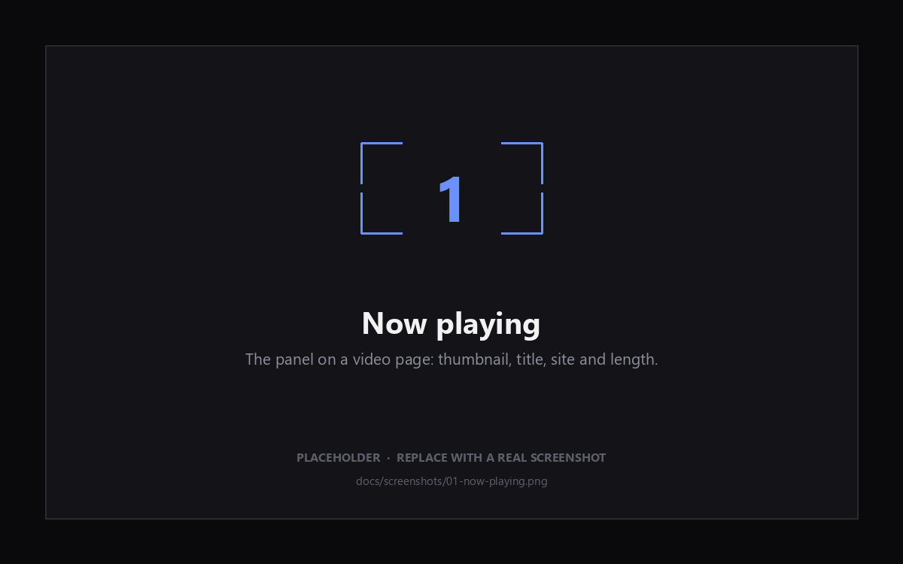

# Grab — Video Downloader

A personal video downloader in two parts:

- **A local server** (`server/`) — FastAPI wrapping yt-dlp and ffmpeg. It knows
  the sites, picks real formats, and muxes properly.
- **A browser extension** (`src/`) — Manifest V3, unpacked. It detects what the
  current tab is playing, shows it, and asks the server to fetch it.

Start the server once and leave it running; after that the extension is the
whole interface. Everything stays on your machine — the extension talks only to
the address you configure, which defaults to `http://127.0.0.1:8787`.

The panel is deliberately square — no rounded corners anywhere — with a near
black dark theme, a grey-white light theme, and a liquid-glass download button.

## Screenshots

| | |
| --- | --- |
|  | **Now playing** — thumbnail, title, site and length for the one video the page is playing. |
|  | **Quality and download** — the yt-dlp quality ladder, and the glass button filling with progress. |
|  | **Right-click to a window** — *Download with Grab…* opens a window that stays put. |

<sub>Those three files are placeholders. Replace them in `docs/screenshots/`
keeping the same names and the README picks them up.</sub>

---

## 1. Install the server

You need **Python 3.10+** and **ffmpeg on your PATH**. ffmpeg is not optional:
without it there is no merged MP4 above 720p and no MP3 at all.

```bash
# ffmpeg
winget install Gyan.FFmpeg          # Windows
brew install ffmpeg                 # macOS
sudo apt install ffmpeg             # Debian/Ubuntu

# the server itself
pip install -r server/requirements.txt
```

Check it took: `ffmpeg -version` should print something.

## 2. Start the server

Paths below are relative to the repo root. If you keep a virtualenv inside
`server/` you will usually be one level down instead — drop the `server/`
prefix and run `python server.py`.

```bash
python server/server.py        # from the repo root
cd server && python server.py  # from inside server/
```

```
Grab server on http://127.0.0.1:8787  ->  C:\Users\you\Downloads\Grab
```

It stays in the foreground; leave that terminal open, and Ctrl+C to stop it.

If it exits with `[Errno 10048] only one usage of each socket address`, the
port is already taken — usually by a copy of this server you forgot was
running. Either use that one, or free the port:

```powershell
Get-NetTCPConnection -LocalPort 8787 -State Listen |
  ForEach-Object { Stop-Process -Id $_.OwningProcess -Force }
```

Useful flags — each also readable from a `GRAB_*` environment variable:

| Flag | Default | What it does |
| --- | --- | --- |
| `--port` | `8787` | Port to listen on |
| `--dir` | `~/Downloads/Grab` | Where finished files land |
| `--host` | `127.0.0.1` | Leave this alone unless you mean it |
| `--workers` | `3` | Concurrent downloads |
| `--cookies-from-browser` | off | `chrome`, `edge`, `firefox`, `brave` … |
| `--cookies` | off | Path to a `cookies.txt` |

`--cookies-from-browser chrome` is what makes private and logged-in videos work
— Instagram, Facebook, and LinkedIn generally need it. Close Chrome first; it
locks its cookie database while running.

Keeping yt-dlp current matters more than anything else here, because sites
change constantly: `pip install -U yt-dlp`.

## 3. Load the extension

1. Open `chrome://extensions` and turn on **Developer mode**.
2. **Load unpacked** → select this folder.
3. Pin it, so the badge stays visible.

Chrome or Edge **116+** (offscreen documents and `chrome.runtime.getContexts`).

## 4. Point it at your server

Two places, same setting:

- **In the popup** — the server button sits next to the theme toggle, with a dot
  showing green when the server answers and red when it does not. Click it for
  an inline field with the address, then **Save**.
- **In the options page** — **More** in that bar, or the extension's Details →
  Extension options. Adds a connection test that reports the yt-dlp version,
  whether ffmpeg was found, and where files are being written.

Only change it if you moved the server's port or host.

---

## Using it

Press play, then open the panel. It shows the one video the page is playing —
thumbnail, title, site, length — not a list of every media URL that went past.
Pick a quality and press **Download**.

- **Quality** comes from yt-dlp: a resolution ladder for what the site actually
  has, plus **Audio only** for MP3.
- The glass button fills with progress and reports `preparing → downloading →
  merging → saved`. Clicking it mid-run cancels.
- When it finishes, the file is pulled into your normal Downloads folder *and*
  kept in the server's directory. The completion note is clickable — it opens
  that folder.
- **Paste a link** at the bottom for anything outside the current tab. With the
  server running this is the main path: paste a YouTube, Instagram, or LinkedIn
  URL and it resolves straight away.
- **Right-click** any page, video, or link → **Download with Grab…**. That fills
  the link in and opens the panel as a **separate window**, which stays open
  until you close it.

### Why the right-click opens a window

Chrome closes a toolbar popup the instant it loses focus, and no extension can
stop it — there is no API for it. So the context menu opens a real window
instead. It stays put, survives clicking elsewhere, and is resizable. The
pop-out button in the toolbar popup (next to the theme toggle) detaches it the
same way.

Your download was never actually pausing when the popup vanished: the server
keeps working regardless, and the file still lands. Only the progress display
was disappearing. The panel now reads progress straight from the server rather
than waiting to be told, so it reports the truth even if the extension's
background worker has been suspended in the meantime.

### Which link the right-click uses

Never the media source. On Instagram, Facebook, and anything else built on
MediaSource, the video element's `src` is a `blob:` handle or a signed CDN
chunk, and the server can do nothing with either. What it wants is the page the
video lives on. So, in order:

1. The link you right-clicked, if you right-clicked one.
2. A selected URL, if you right-clicked a selection.
3. **The post's own permalink** — on a feed the address bar points at the feed,
   not the video, so the page is asked for the nearest post link around the
   element you clicked. On a page that is already a post or a watch page, its
   canonical URL is used directly; hunting the DOM there would find a
   recommendation instead of what you are watching.
4. The frame URL, then the page URL. An embedded player reports its own URL,
   which yt-dlp handles even when the surrounding article is not recognised.

Tracking parameters are stripped, so what lands in the link field is the clean
permalink: `utm_*`, `fbclid`, `igshid`, `si`, `t`, and the rest. Meaningful ones
survive — YouTube's `v`, Vimeo's privacy `h`.

### If the server is not running

The extension falls back to what a browser can do alone: sniffing media off the
network, reading `<video>` from the DOM, and assembling HLS/DASH segments in an
offscreen document. The dot turns red and a note says so.

That path is strictly worse — no muxing, so split streams save as separate video
and audio files; no MP3 conversion; no site-specific extraction. It exists so
the extension still does something useful before you have started the server,
not as an equal alternative.

---

## Layout

```
manifest.json            MV3, module service worker
server/
  server.py              FastAPI + yt-dlp; also the entrypoint
  requirements.txt
  pyproject.toml
src/
  background.js          Server jobs, context menus, sniffing, fallback downloads
  content.js             Picks the playing video; reports title/poster/length
  lib/api.js             Server client, shared by worker, popup, and options
  lib/theme.css          Design tokens and reset, shared by every page
  offscreen/             HLS/DASH assembly (fallback only)
  options/               Full settings page
  popup/                 The panel (+ preview.html, a dev harness)
tools/make-icons.py      Regenerates every icon from logo.jpg
icons/                   Generated — do not edit by hand
```

### Server API

| Endpoint | Purpose |
| --- | --- |
| `GET /health` | Status, versions, whether ffmpeg was found, download directory |
| `POST /info` | `{url}` → title, thumbnail, duration, and a ready-made `options` list |
| `POST /download` | `{url, type, height, format_id}` → `{job_id}` |
| `GET /progress/{id}` | `status`, `percent`, `speed`, `eta`, `filename`, `error` |
| `GET /file/{id}` | The finished file |
| `POST /cancel/{id}` | Stop a running job |
| `POST /reveal/{id}` | Open the containing folder locally |
| `GET /jobs` | Everything this run has done |

`/info` returns a short curated `options` list rather than yt-dlp's raw format
table, so the extension never reasons about codecs — it just echoes one option
back to `/download`.

---

## Notes worth reading

**CORS is the access control.** The server only accepts browser-extension
origins. A normal web page cannot reach it: every endpoint requires
`application/json`, which forces a preflight that this policy rejects for
`http(s)` origins. Keep `--host` on loopback — this process downloads any URL it
is handed, and binding it to `0.0.0.0` hands that to your whole network.

**`<all_urls>` is in the permissions.** It is needed for the media sniffing that
powers detection and the offline fallback, and the API address is
user-configurable so it cannot be narrowed to localhost. The rest is minimal:
`downloads`, `storage`, `tabs`, `webRequest`, `offscreen`, `scripting`,
`contextMenus`.

**Live streams** download only the window the playlist currently advertises.

**DRM is out of scope.** Netflix, Disney+, and anything else using Widevine or
FairPlay will not work, and no part of this attempts to decrypt them.

Downloading is subject to the terms of the site you are on and to copyright. Use
it on material you have the right to keep.

---

## Working on the UI

`src/popup/preview.html` renders the panel with stub data and a stubbed server,
so you can iterate on CSS without reloading the extension. It is not referenced
by the manifest.

It has to be served over HTTP — the popup uses ES modules, which browsers refuse
to load from `file://`:

```bash
python -m http.server 8899
# http://127.0.0.1:8899/src/popup/preview.html?theme=dark&state=playing
#   theme = dark | light
#   state   = playing | empty | busy | offline | apibar
#   surface = window   (renders the detached-window layout)
#   measure = 1        (stamps layout widths onto <html> for --dump-dom)
#
# Headless screenshots below ~500px wide get cropped rather than reflowed,
# so check narrow layouts at 520px or wider.
```

`tools/context-url-test.html` checks the right-click URL resolution against
feed, watch-page, and permalink markup. Open it over the same HTTP server; the
tab title reads `ALL PASS` or `FAILURES`, and `<html data-results>` carries the
detail.

Icons are generated from `logo.jpg`, the single source of truth for artwork:

```bash
python tools/make-icons.py
```

It crops to the mark and emits both families — toolbar tiles that keep the
logo's light background so they read on any toolbar, and background-removed
header marks tinted per theme.
